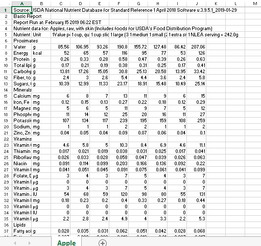

# DESIGN
## DATA
The USDA website has CSV's which can be downloaded for almost all food and drink related products, including, guess what, FRUIT! However, not all data present in the CSV's will be relevant for my document, and the CSV's need to be merged somehow in order to make it suitable for data processing. Below you can see an image of how a fruit CSV looks like.

Since a lot of this information is irrelevant, I will focus on getting the value per 100 grams of each fruit. Like this I will be able to make a giant table with nutrient per 100 grams as rows and fruits as columns. This can be converted to a suitable json for my project. In order to create the table, I will use python and pandas to trim and shape the data until it has a preferable shape. This shape will be imported as a json and used for the rest of the project. Furthermore, I think it might be interesting to see if there is a connection between the color of the flesh of a fruit and the nutritional values. Therefore I will also document the name of each fruit per color, which will also be converted into a separate json with fruits and their colors.

