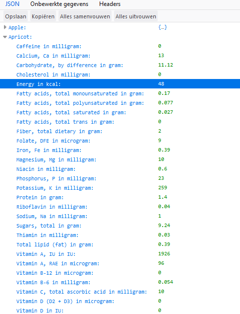
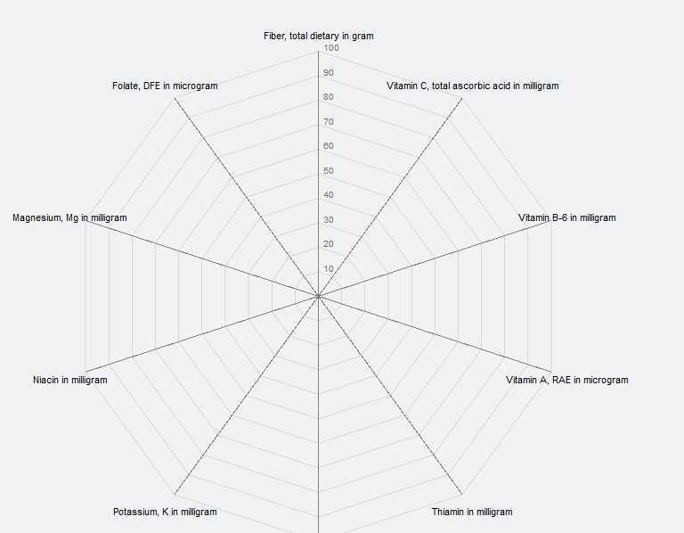
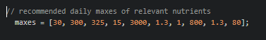
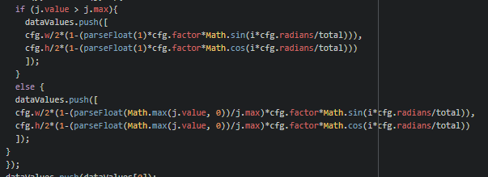
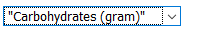
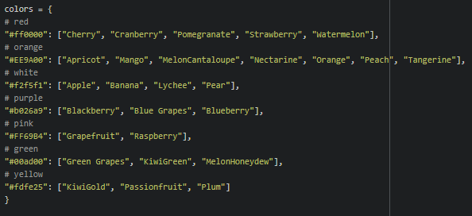
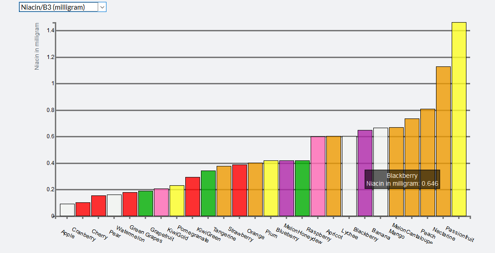
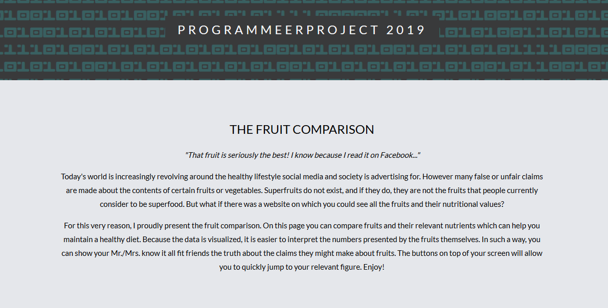
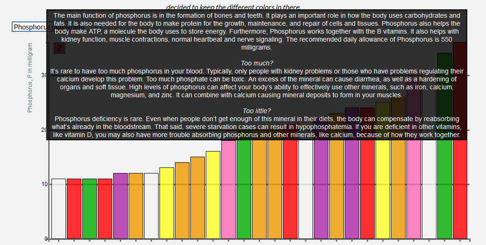

## Process book 

### April 14th (day 1) 
I started formatting the collected fruit CSV's. It had been a while since I programmed so I was a little rusty. However at the end of the day I got all the data into a dataframe and saved as a jsonfile. 

### April 15th (day 2)
I make the decision to start working from inside out. By this I mean first getting the figures to work in separate plain HTML scripts before merging everything into a larger document. The reason for this decision was to make the whole thing more organized and easier to understand in case I would run into trouble. In order to get back in the programming flow, I started out with the bar chart. For the data I took only the data of Apples, following along the inside out fashion. 

### April 19th (day 3)
The bar chart is working, however I had to morph the json file a little within javascript in order to make it suitable for the chart. The bar chart has basic functionality, but still looks awful. However, all of this can be fixed quite easily (if I take my time), so I decide to now start working on the radar chart. Since the radar chart will be the biggest challenge due to it being circular, this is what I am starting out early with, because I do not want to run into surprises when the deadline is closing in. At the end of the day I understand a lot more than I did before, however this is not yet visible in terms of progress. 

### April 20th (day 4)
Another day of working on the radar chart, however the data is refusing to display itself. The rest of the chart shows however, which is quite a good bit of progression. I think it might have to do something with the format of the data or the way I am calling it. 

### April 21st (day 5)
I get the web to work! However the dots on the spokes of the radar chart with an included tooltip are not yet showing. Another problem occurs: when I draw the figure for a fruit that has a nutrient which meets more than your daily recommended allowance, it draws outside of the chart. I will have to have to create a condition where anything above 100% is trimmed to 100%.

### April 26th (day 6)
It took me forever to get the tooltip right. However I got it to work after a long day of work. Probably one of my worst days so far. 

### April 27th (day 7)
Today I focused on writing the condition so that the web would not be drawn beyond the boundaries of the chart. This was more challenging than I thought, because there were different recommended daily allowances for every nutrient. This meant that I could not just write a "if is lower than a number" function, but I had to come up with something else. I then figured I needed to map all the maximum values and add these to the fruit data object. 

### April 30th (day 8, working at night)
In order to ensure that I would not run into time crisis, I decide that I am going to have to work at night as well. I mapped all the maxes, and added these to the fruit object. Now I can write a piece of script: if the value is higher than the max, use the max. This works! I now have a radar chart where the "web" in the chart does not go out of bounds. 

### May 3rd (day 9)
Now that I have the bar chart and the radar chart, I need the charts to be able to switch between fruits or nutrients. I figure the easiest way to do this is by a drop down menu. This involves some HTML as well and I was quite rusty with this, so it took me some time to get this right. After some thorough googling, I first got it right for the bar chart. The on.click function was doing the trick. 

### May 4th (day 10)
I finish the drop down switch for the radar chart. I now figure that it is time to merge my two figures together into one HTML page, as this is where I wanted to go in the beginning. I spend the rest of the day making a web layout that suits the project. 

### May 5th (day 11)
I continue the work on my HTML page. I then try to figure out how I am going to fit my figures into the page properly. The position of the figures seem to pose a problem. 

### May 6th (day 12, working at night)
I am super tired today, so I decide to do something easy. I map out the colors of the fruit flesh of all the fruits I have so far. I also start to make a beginning on how to incorporate this in the bar chart. The idea is that every bar gets the color of its flesh in order to spot patterns. 

### May 7th (day 13, working at night)
Another couple of hours spent on incorporating the colors. I finally figure the easiest way to do it is to add a key value with a hex color as value. I write some script to make this possible and implement it. 

### May 10th (day 14)
An absolutely horrible day. I try to merge both figures into my html script. However I cannot get it to work properly, as the bar chart draws over the radar chart. It has something to do with the way I define my svg's. I try to fix it all day, and even though I learn a lot I still cannot manage to get it done. 

### May 11th (day 15)
I get everything I was stuck on the day before done within an hour. Apparently I had to give the dropdowns different names so that I could separately call them in my functions. Good nights of sleep are so important... Now that everything is properly in place and working, I start focusing on the looks of my figures again. I make the bars a little translucent and style the tooltips differently. I also try to make the bars change color and expand a little. However I run into the problem that either my bars dont expand, or my tooltip does not show. 

### May 12th (day 16)
Basically 100 grams of fruit is hardly satisfying any needs except vitamin C, so I decide to add a factor variable. The integer that is entered will multiply the 100 grams, making the radar 'web' more meaningful and appealing. Especially now the bars have different colors, the bar chart looks really messy. Therefore I roam the internet in order to learn how to "sort" an object by values. I say "sort" because it is not actually possible to really sort an object. I manage to sort the bars, and the sorted bar charts now look much better than they did before. I also figure that I should program a second web in the radar chart, so that fruits can be compared head to head instead of only one at a time. 

### May 14th (day 17, working at night)
Today couldn't have gone any better, as I out of the blue came up with how to program a second web into radar chart. However it does not work perfectly yet, as you first have to select the second drop down before the first one in order to even make it work. I also send an e-mail with the request for feedback on my progression. 

### May 15th (day 18, working at night)
Because of the reply on Martijn's e-mail, I started to get my readme in place to make it suitable for fitting the project requirements. I also made a start in DESIGN.MD. 

### May 17th (day 19)
Today I got my logbook in place. I tried to enter my progression as accurately as I could by looking back in my files and their save history. I put the web drawing code into a function so that the code is not written twice. Furthermore I got terribly stuck on the functionality of the two webs showing at the same time, however, I solved how to fix it which I will be doing tomorrow. 

### May 18th (day 20)
I fixed the double web problem, and now it displays either one or two webs. I also came up with the idea to skip the factor variable. Instead, I am going to let the user decide how many grams they want to compare for, by adding a box where you can fill in an amount of grams. I made quite a good start, however it is not fully functional because the webs do not update yet if you only change the amount of grams and not the fruit types. 

### May 19th (day 21)
I fixed the grams problem! Now you can fill in an amount of grams. The base value is set at 100. It is now time to add the scatterplot with the calories on the y axis and the nutrient on the x axis. I plan to work from inside out again.

### May 22nd (day 22, working at night)
Today I did some easy, no-brain stuff (because it was a long day). I added text to my website and made it look nice by adding an intro and changing banner images. 

### May 24th (day 23)
Today I added a "legend" to my radar chart by coloring the drop downs in the same fashion as the "webs" of the radar chart. Furthermore I ensured that all dots of the of the webs have a tooltip on hover, by first drawing the webs and then the dots. I then added a "info button" in the top left of the the nutrient comparison bar chart. I still have to adjust all the text before I will definitively add it to the data, but you can see a preview when you select carbohydrates. Furthermore I added some background color and adjusted some images, and aligned the radar chart better. Quite a productive day! 

### May 25th (day 24)
Today I structured my files into correct folders, in a hopefully desirable structure in the eyes of the tutors. I also added some outline to the bars and the dots so I can maintain the white fruitflesh color. Furthermore I added some cosmetic changes to make the whole thing look nicer. 

### May 26th (day 25)
Today I spent all day getting my additional nutrient information in place. It was more work than expected, 2800 words. 
