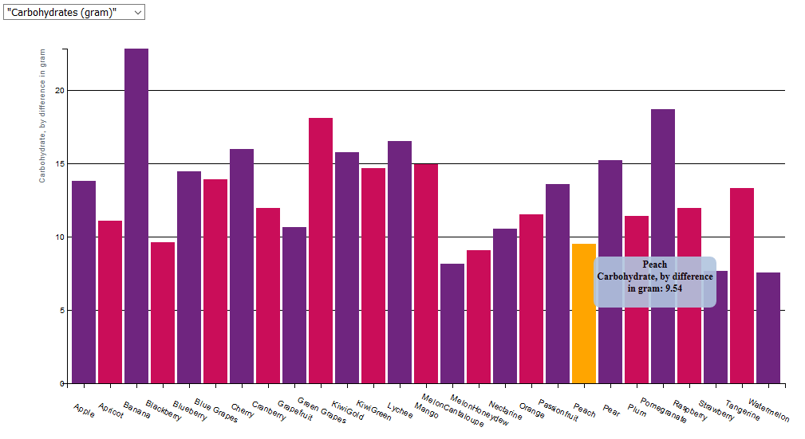
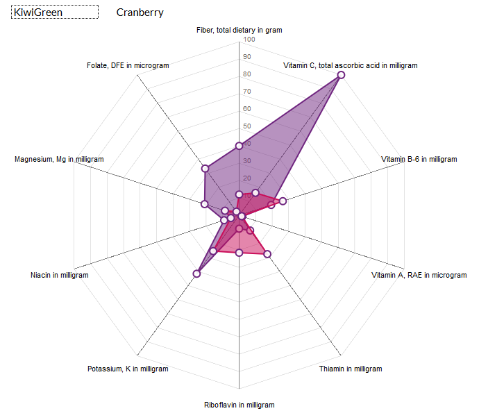
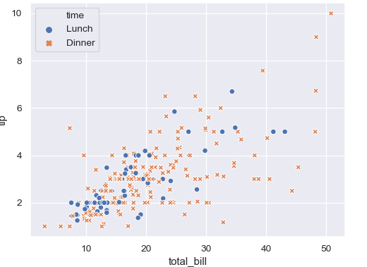

# Dataproject
## Problem statement
Today's world is increasingly revolving around the healthy lifestyle social media and society is advertising for. However many false or unfair claims are made about the contents of certain fruits or vegetables. Superfruits do not exist, and if they do, they are not the fruits that people currently consider to be superfood. But what if there was a website on which you could see all the fruits and their nutritional values?

## Solution
The current project will visualize the nutrients in fruits and makes the user able to see for himself which fruits contain high amounts of certain nutrients, but also to compare fruits head to head so that conclusions can be drawn about the true health benefits of certain fruits. The user should be able to see the differences and the qualities of fruits in a matter of moments by looking at the visualizations presented in the project. 
### Sketches

### Main features - MVP
The main features of this data project will be the ability to compare the micro nutrients head to head for each fruit by means of a bar chart. When you select a nutrient for comparing fruits, an info button will be present that when clicked will display information about the currently selected nutrient. In this way even less informed people can still fully enjoy the functionality and the meaning of the website. There will also be a radar chart on which you can select a fruit to see to which extend it satisfies your recommended daily allowance per a certain unit of weight. Furthermore there will be a scatterplot of fruits with on one axis the amount of calories per weight unit compared to the percentage of your recommended daily allowance for each nutrient. All figures will be able to be viewed on one page, but you can quickly move to each section by a button menu that moves along with the window while scrolling through the page.

### Main features - optional
On top of that I also want the user to be able to add a second fruit to the radar chart, so that all nutrients can be compared head-to-head. This will identify the "real" superfruits if they are out there. If there is time left, I also want to make some kind of indication of the carbon food print (for all the vegan hippies out there). I currently have the idea to do this based on location. You enter your country and the distance between you and the place where the fruit is grown will determine the eco-friendliness of the fruit. I would also like to incorporate a nutrient-to-calorie ratio, as some fruits are very nutritious but also very high on sugar. 

## Prerequisites
### Data sources
All CSV's will be downloaded from the USDA website. The data is a product of lab tested fruit, and document in extensive CSV's. By using python I will extract the relevant of as many fruits as possible into one large json file. This file will serve as the data which I am going to use for the project. https://ndb.nal.usda.gov/ndb/search/list
### External components
I will use a website template from w3 schools and adapt it so that it is themed like my project and fits the d3 figures. 
### Similar visualizations
All visualizations one can find online are not extensive, or text only. Just numbers are very hard to compare in large quantities. 
### Pitfalls
Since I have not coded a radar chart before, the biggest challenge will lie there. Furthermore I am not very good at creative design or art, so really making the figures look nice and smooth will be a challenge. Also keeping my code clean and using functions will be a challenge, since I tend to make something work first and then clean up the script. 

